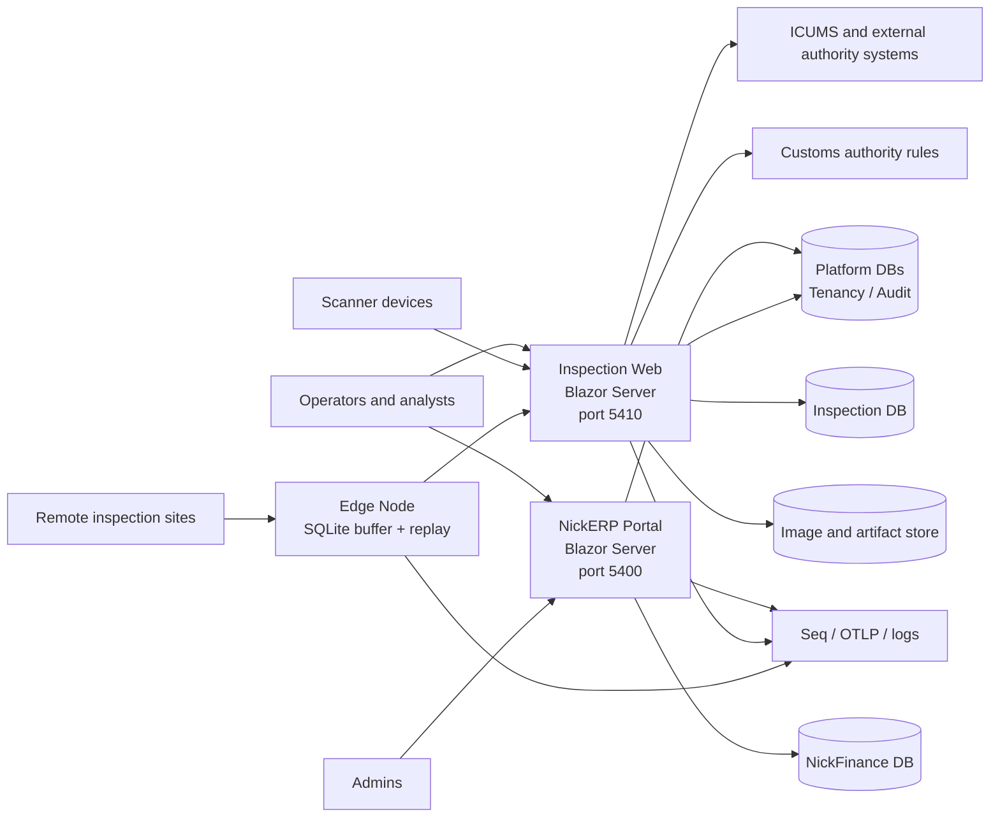
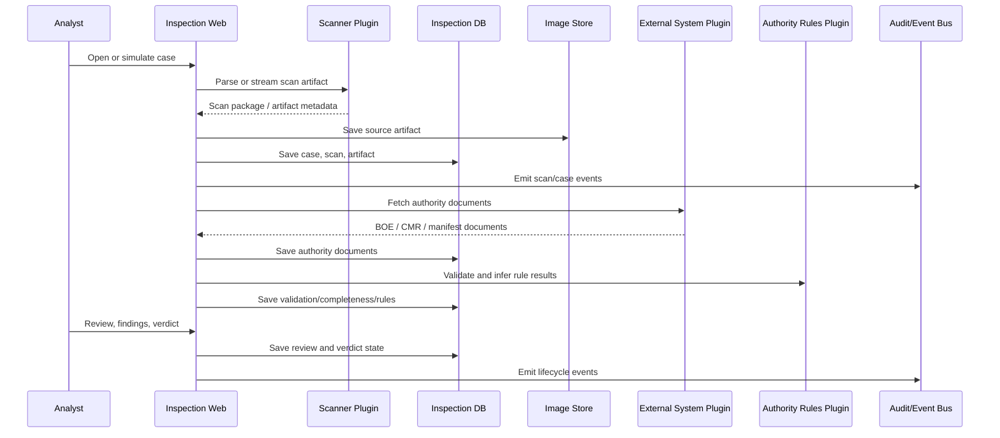
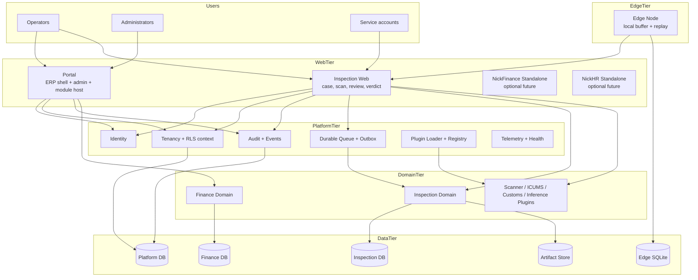
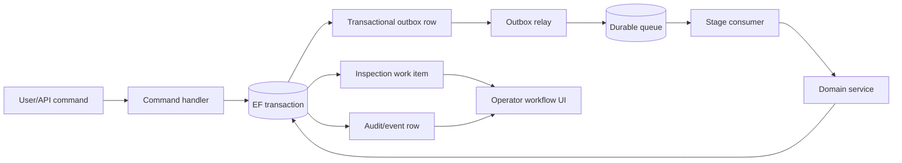
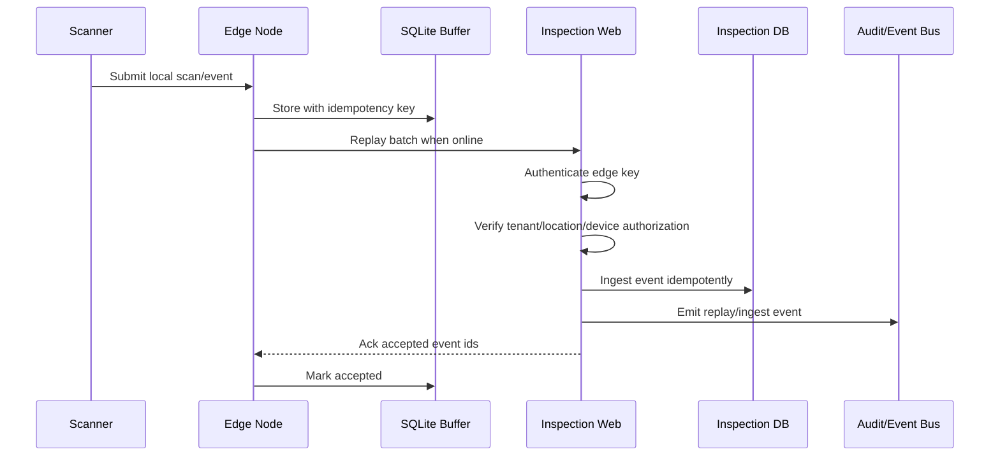

# NickERP v2 Architectural Analysis and Design

Date: 2026-05-13

Scope: `C:\Shared\ERP V2`

Status: Source-backed architecture review and target design proposal

## 1. Executive Summary

NickERP v2 is no longer only a planning repository. The current codebase is a .NET 10 monorepo with active Blazor Server applications, a shared platform layer, inspection-domain modules, a v2-native NickFinance pathfinder, an edge node, plugin contracts, database projects, and a broad automated test suite.

The architectural direction is strong: a multi-tenant, location-federated ERP platform with domain modules, plugin-driven integration points, Postgres-backed tenancy and audit, and edge replay for intermittent sites. The main shape is coherent and appropriate for the stated goal of replacing vendor-bound inspection and operational systems.

The main architectural concern is that several layers have advanced at different speeds. The repository contains both a mature synchronous inspection workflow and a newer queue-backed workflow substrate. The newer substrate is not yet production-ready: the E2E host currently fails startup because queue services are missing dependency registrations and one hosted-service constructor is not public. In addition, the queue/state-machine design comments claim transactional atomicity that the current implementation does not actually provide.

This document separates current state from target architecture, then proposes a practical design path that preserves the good modular structure while fixing the correctness risks before more workflow stages are moved onto queues.

## 2. Verification Snapshot

Commands run from repository root:

```powershell
dotnet --version
dotnet build NickERP.Tests.slnx --no-restore
dotnet test NickERP.Tests.slnx --no-build --logger "console;verbosity=minimal"
```

Observed results:

- SDK: `.NET 10.0.202`
- Build: succeeded
- Build warnings: 41, mostly Blazor form-binding warnings, XML doc warnings, nullability warnings, and one obsolete scanner API warning.
- Tests: not green.
- Passing test assemblies included scanner plugins, customs authority rules, ICUMS adapter tests, NickFinance core/database/web tests, EdgeNode tests, and most Inspection Web tests.
- Failing areas:
  - `NickERP.Platform.Tests`: 3 failures around migration/schema isolation, tenant/RLS expectations, and system context behavior.
  - `NickERP.Inspection.E2E.Tests`: 2 failures because the Inspection Web host cannot build with the current queueing service graph.

Important E2E host failure details:

- `QueueJanitor` cannot be constructed by Microsoft DI because its constructor is not publicly available.
- `QueueConsumerHost<T>` requires `NickERP.Platform.Queueing.Services.ITenantContextActivator`, but no implementation/registration was found in the current service graph.
- The failure occurs while building the Inspection Web host.

## 3. Repository Shape

The repository is organized as a modular monorepo:

```text
apps/
  edge-node/
  portal/
modules/
  inspection/
  nickfinance/
platform/
  NickERP.Platform.*
tests/
  NickERP.*.Tests
v1-clone/
  NickFinance/
  NickHR/
docs/
tools/
storage/
publish/
```

The active solution file is `NickERP.Tests.slnx`. It includes the v2 platform, portal, inspection, edge-node, and NickFinance projects. The `v1-clone` tree is co-located, but it is not part of the active v2 solution and should be treated as a compatibility/reference island rather than as the current ERP architecture.

There is also documentation drift:

- `README.md` still says the repository is in a design-only phase.
- `ROADMAP.md` and the code show a much more advanced implementation.
- The edge-node README still describes older assumptions while the code and roadmap have moved toward per-edge API keys and richer event replay.

Recommendation: keep one current-state architecture document and one target-state roadmap. Avoid mixing early design notes with active deployment facts.

## 4. Current System Architecture

### 4.1 System Context



### 4.2 Main Runtime Containers

| Container | Current role | Status |
| --- | --- | --- |
| Portal | Blazor Server shell for ERP navigation, platform admin, tenant lifecycle, health, and hosted module pages | Active |
| Inspection Web | Blazor Server inspection application with scanner ingest, documents, analyst workflows, plugins, imaging, queues, and edge replay endpoint | Active but E2E host currently fails due queue DI |
| Edge Node | Lightweight local service using SQLite buffering and replay to central Inspection Web | Active pathfinder |
| NickFinance Web module | v2-native petty-cash pathfinder hosted inside Portal when configured | Active module |
| NickFinance/NickHR v1 clone | Legacy clone/reference implementation | Co-located, not active v2 solution |
| Postgres | Primary persistence for platform, audit, inspection, and finance modules | Active |
| File storage | Source scan artifacts and rendered image derivatives | Active |
| Plugin folders | Runtime plugin discovery for scanners, external systems, authorities, and inference | Active concept, deployment consistency needs work |

### 4.3 Current Deployment Assumptions

The deployment scripts primarily publish and install:

- `NickERP.Portal` on `127.0.0.1:5400`
- `NickERP.Inspection.Web` on `127.0.0.1:5410`

The scripts reserve room for:

- NickFinance standalone on `5420`
- NickHR standalone on `5430`
- Edge node deployment

At the moment, NickFinance v2 is primarily a Portal-hosted module. Edge node deployment is separate/manual compared with the main Portal and Inspection Web install path.

## 5. Platform Architecture

The platform layer is a set of shared libraries under `platform/NickERP.Platform.*`.

### 5.1 Identity

The identity package supports Cloudflare Access and development bypass authentication. The authentication handler emits NickERP-specific claims such as:

- user id
- display name
- tenant id
- service token flag
- email
- roles/scopes

This keeps application modules from binding directly to Cloudflare-specific token structures.

### 5.2 Tenancy

The tenancy package provides:

- scoped `ITenantContext`
- scoped `IUserContext`
- tenant middleware
- EF interceptors for tenant-owned entities
- connection interceptors that set Postgres session variables such as `app.tenant_id` and `app.user_id`

The design intent is good: every request should resolve tenant and user context early, and every EF connection should carry that context into Postgres for row-level security and auditing.

The current risk is that not all persistence paths use EF connections. Queueing uses a raw `NpgsqlDataSource`, so it bypasses the EF connection interceptor unless queueing explicitly sets session context itself.

### 5.3 Audit and Events

The audit package provides:

- `AuditDbContext`
- event publishing
- in-process event bus
- notification projection
- audit-related persistence

Inspection and Portal both use the platform audit/events substrate. This is the right direction for cross-module traceability.

### 5.4 Queueing

The queueing package provides a Postgres-backed queue abstraction:

- durable queue tables
- idempotent enqueue
- claim/complete/fail lifecycle
- dead-letter support
- `LISTEN/NOTIFY`
- hosted consumers
- janitor/relay/metrics services

However, the current integration is incomplete:

- hosted consumer startup fails because `ITenantContextActivator` is missing
- `QueueJanitor` is not constructible by default DI
- queue producers do not share the same EF transaction as the state machine transitions that invoke them
- queue commands need explicit tenant context handling because they use raw `NpgsqlDataSource`

This is the highest-priority architecture repair area.

### 5.5 Plugins

The plugin layer supports plugin manifests and contract-based discovery. Inspection uses this for:

- scanner adapters
- external system adapters
- authority rule providers
- inference runners
- webhook adapters

The plugin model is a strong fit for the domain because scanner vendors, customs authority rules, country-specific external systems, and inference runtimes are all high-change integration points.

Current risk: some newer inference plugin manifests/classes do not include the required `module` metadata while the loader requires it. Those plugins will not reliably load under the current rules.

## 6. Inspection Module Architecture

The inspection module is the most developed domain area.

### 6.1 Package Boundaries

```text
modules/inspection/src/
  NickERP.Inspection.Core
  NickERP.Inspection.Database
  NickERP.Inspection.Application
  NickERP.Inspection.Web
  NickERP.Inspection.Imaging
  NickERP.Inspection.Abstractions.*
modules/inspection/plugins/
  NickERP.Inspection.Scanners.*
  NickERP.Inspection.ExternalSystems.*
  NickERP.Inspection.Authorities.*
  NickERP.Inspection.Inference.*
```

### 6.2 Domain Model

The core model includes:

- inspection cases
- scans
- scan artifacts
- rendered artifacts
- authority documents
- rule evaluations
- validation and completeness results
- review sessions
- findings
- verdicts
- outbound submissions
- case claims
- SLA windows
- queue work items and state transitions
- scanner thresholds
- post-hoc outcomes
- retention markers

The model is rich enough to support an end-to-end inspection lifecycle, auditability, and future analytics.

### 6.3 Current Inspection Flow



### 6.4 Imaging Flow

The imaging package stores source artifacts content-addressably and creates rendered image derivatives.

Current behavior:

- source artifacts are saved under content-hash paths
- render artifacts are saved under scan-artifact/kind paths
- thumbnail and preview renders are generated by a polling background worker
- image responses use ETags and cache-control headers

Design note: the current implementation acknowledges that a durable queue plus in-memory channel was originally intended, but the current behavior is polling. Polling is acceptable for a pathfinder, but production scale should move render requests onto the same durable work model as the rest of the inspection workflow.

### 6.5 Synchronous Workflow vs Queue Workflow

There are two workflow styles currently present:

1. Mature synchronous services in `CaseWorkflowService` and related application services.
2. Newer `InspectionWorkItem` state-machine and queue-based S+3 workflow scaffolding.

This creates a split-brain risk:

- `CaseWorkflowService` still mutates `InspectionCase.State` directly in some paths.
- The newer state machine records work-item transitions and attempts to enqueue follow-up stages.
- Several queue consumers are currently placeholders that log TODO messages and complete.

Recommendation: pick one canonical lifecycle authority. The cleanest path is to make the queue-backed state machine the canonical workflow for long-running stages, while keeping synchronous service methods as command handlers that create or advance work items.

## 7. NickFinance Module Architecture

NickFinance v2 is a smaller but cleaner bounded context.

Current scope:

- petty cash boxes
- vouchers
- approvals/rejections/cancellations
- disbursement
- reconciliation
- FX rates
- period close/reopen
- tenant base currency lookup

Portal hosts NickFinance pages and API endpoints when a NickFinance connection string is configured.

Current endpoints include:

- `/api/nickfinance/vouchers/{id}/approve`
- `/api/nickfinance/vouchers/{id}/reject`
- `/api/nickfinance/vouchers/{id}/cancel`
- `/api/nickfinance/vouchers/{id}/disburse`
- `/api/nickfinance/vouchers/{id}/reconcile`
- `/api/nickfinance/fx-rates`
- `/api/nickfinance/periods/{ym}/close`
- `/api/nickfinance/periods/{ym}/reopen`

Architecturally, NickFinance is a good example of how smaller ERP modules should fit into the platform:

- module-specific Core/Database/Web packages
- platform tenancy and audit integration
- Portal-hosted navigation and pages
- module-specific database context
- scoped workflow services

The design should preserve this pattern for future modules.

## 8. Edge Node Architecture

The edge node is a lightweight service for remote/intermittent sites.

Current responsibilities:

- local SQLite buffering
- accepting local edge events
- replaying buffered events to central Inspection Web
- exposing anonymous health endpoint
- running replay as a hosted service

Target responsibilities:

- accept scan metadata and local inspection events while central connectivity is down
- authenticate to central services with per-edge credentials
- replay with idempotency keys
- expose buffer depth and replay health metrics
- enforce tenant/location authorization per edge device

The edge node should remain intentionally small. It should not become a parallel inspection application. It should buffer, validate, and replay.

## 9. Current Data Architecture

### 9.1 Databases

Current design uses separate module databases:

- platform/tenancy/audit database
- inspection database
- NickFinance database
- edge-node SQLite database

This separation is reasonable because inspection imaging/workflow and finance accounting have different growth, retention, and access characteristics.

### 9.2 Tenancy Model

The roadmap locks the hierarchy as:

```text
Tenant -> optional Region -> Location -> Station -> Device
```

This matches the inspection domain well:

- tenant separates organizations
- location separates ports/sites
- station separates operational checkpoints
- device maps to scanner or edge hardware

Recommendation: keep this hierarchy in platform tenancy, but avoid making every module depend on every level. Finance may need tenant/location, but not station/device. Inspection needs all levels.

### 9.3 Storage

The image/artifact storage design separates:

- canonical source artifacts
- rendered derivatives
- relational metadata

That is the right model. The relational database should own identity, tenant, case, scan, and metadata. Blob/file storage should own large binary content.

## 10. Critical Architecture Findings

### Finding 1: Queueing DI currently breaks Inspection Web E2E startup

Severity: Critical

The Inspection Web host cannot build under E2E tests because queueing hosted services are not fully registered/constructible.

Evidence:

- `QueueJanitor` constructor is not accessible to default DI.
- `QueueConsumerHost<T>` requires `ITenantContextActivator`, but no implementation/registration was found.

Impact:

- E2E tests fail before validating inspection workflows.
- Queue-backed workflow stages cannot be treated as production-ready.
- Any deployment path that enables these hosted services risks startup failure.

Design fix:

- Add a tenancy-owned implementation such as `TenantContextActivator`.
- Register it in `AddNickErpTenancy` or `AddNickErpQueueing` integration.
- Make `QueueJanitor` constructible or register it with an explicit factory.
- Add a queueing host composition test that builds `Inspection.Web` with production-like service registration.

### Finding 2: State-machine transitions and queue enqueues are not atomic

Severity: Critical

The state-machine comments describe an atomic transition, audit row, and queue insert. The current implementation opens a separate queue connection through `NpgsqlDataSource`, so queue inserts cannot participate in the EF transaction that updates work-item state.

Impact:

- A queue item can be committed even if the state transition rolls back.
- A state transition can commit even if the queue insert fails.
- Retry and recovery semantics become unclear.

Design fix:

Use one of these patterns:

1. Transactional outbox:
   - command handler writes state transition and outbox row in the same EF transaction
   - outbox relay publishes durable queue rows after commit
   - consumers are idempotent

2. Shared connection transaction:
   - queue enqueue accepts the current `DbConnection` and `DbTransaction`
   - queue row is inserted inside the same transaction
   - explicit tenant id is passed, not inferred accidentally from session state

Preferred option: transactional outbox. It is simpler to reason about for long-running ERP workflows.

### Finding 3: Queueing bypasses EF tenant connection interceptors

Severity: High

EF database contexts set session tenant/user values through connection interceptors. Queueing uses direct `NpgsqlDataSource` commands. Unless queueing sets session variables itself, it does not inherit the EF tenant context.

Impact:

- queue rows may be written with tenant id 0/default
- RLS policies may fail unexpectedly
- background claims may see no rows or the wrong rows
- audit attribution can drift from request attribution

Design fix:

- queue enqueue APIs should require explicit `TenantId`, `LocationId`, and actor/system identity where applicable
- queue connections should set `app.tenant_id` and `app.user_id` before every command
- background consumers should use a registered tenant context activator before resolving domain services
- RLS policies should distinguish request context from approved system context

### Finding 4: Inspection lifecycle has two competing state authorities

Severity: High

The older synchronous workflow mutates `InspectionCase.State` directly. The newer queue-backed workflow uses `InspectionWorkItem` and transition records.

Impact:

- pages may show one lifecycle state while background work tracks another
- audit reports can disagree with queue status
- retry/recovery logic becomes difficult

Design fix:

- make `InspectionWorkItem` the canonical long-running process state
- make `InspectionCase.State` a derived, user-facing summary or a separately governed aggregate state
- require all state changes to flow through one lifecycle service
- block direct state mutation outside that service

### Finding 5: Several S+3 queue consumers are placeholders

Severity: High

The web host registers queue consumers for split detection, image analysis, decision agent, audit assignment, audit review, and submission, but several currently log TODO messages and complete.

Impact:

- a queue row can be marked complete without doing business work
- operators may believe the pipeline ran when it only advanced the technical queue

Design fix:

- consumers should either perform the real stage or fail/requeue with an explicit "not implemented" terminal reason
- expose per-stage operational dashboards before relying on queue status
- add consumer-level integration tests for each stage

### Finding 6: Plugin metadata is inconsistent across plugin families

Severity: Medium

Some inference plugins do not include required module metadata while the loader requires it.

Impact:

- plugins may compile but fail runtime discovery
- deployments can silently lack expected inference capabilities

Design fix:

- require every plugin manifest to include `module`, `type`, `contract`, and `minContractVersion`
- require every `[Plugin]` attribute to include matching module metadata
- add a plugin validation test that loads every plugin manifest in `modules/inspection/plugins`
- add build/publish logic that copies all eligible plugin outputs into the host plugin folder

### Finding 7: Documentation does not match implementation state

Severity: Medium

Some docs describe an unbuilt system. Others describe shipped pilots and active services.

Impact:

- onboarding is confusing
- deployment expectations become unreliable
- architecture decisions are harder to audit

Design fix:

- mark stale docs as historical or archive them
- keep this document or a successor as the current architecture source
- split future roadmap from implemented state

### Finding 8: Blazor form-binding warnings are widespread

Severity: Medium

Many Razor pages use `[SupplyParameterFromForm]` properties with initializers. Blazor warns that form posts may overwrite those values with null.

Impact:

- runtime null behavior on form posts
- inconsistent page behavior under validation failures

Design fix:

- initialize form models in lifecycle methods
- enforce non-null guards before command execution
- add focused page tests around postback failure paths

### Finding 9: Obsolete scanner parsing path remains in production workflow

Severity: Medium

`CaseWorkflowService` still calls obsolete scanner parsing API instead of the canonical `ParseScanAsync` flow.

Impact:

- newer scanner plugins may not exercise the canonical scan package model
- metadata and multi-artifact behavior can diverge by adapter

Design fix:

- migrate ingestion to `ParseScanAsync`
- keep obsolete `ParseAsync` only as an adapter compatibility shim
- add scanner contract tests that verify both legacy and canonical adapters normalize to the same scan package shape

## 11. Proposed Target Architecture

### 11.1 Design Goals

The target architecture should optimize for:

- multi-tenant correctness
- location federation
- auditability
- plugin replaceability
- resilient inspection workflows
- intermittent edge operation
- clear module ownership
- operator-visible workflow state
- predictable deployment

### 11.2 Target Container Design



### 11.3 Module Boundary Rules

Recommended module rules:

- Platform packages define cross-cutting primitives only.
- Domain modules own their entities, database context, workflows, pages, and APIs.
- Web hosts compose modules but do not own domain rules.
- Plugins implement contracts but do not reference host internals.
- Edge node does not own central business logic.
- v1-clone remains isolated until each capability is intentionally migrated.

### 11.4 Tenant Context Design

Every operation should run in one of three context modes:

| Mode | Used by | Requirements |
| --- | --- | --- |
| User context | normal web requests | resolved tenant, user id, roles/scopes |
| Service context | internal background work | explicit tenant, service actor, reason |
| System context | platform maintenance/export/migration | explicit scope, audit reason, limited APIs |

Target implementation:

- expose `ITenantContextActivator` from platform tenancy
- queue consumers call activator before resolving domain services
- queue producers include explicit tenant and location ids
- raw Npgsql commands call a small `IConnectionSessionContextSetter`
- all cross-tenant operations require system context and audit reason

### 11.5 Workflow and Queue Design

The target inspection workflow should be queue-backed for long-running stages, but command-backed for immediate user actions.



Recommended stage model:

1. Case opened
2. Scan received
3. Image render requested
4. Split detection
5. Image analysis
6. Authority documents fetched
7. Validation and completeness evaluation
8. Decision assistance
9. Audit assignment
10. Human review
11. Verdict recorded
12. Outbound submission
13. Post-hoc outcome linked
14. Retention/archive lifecycle

Not every stage must be asynchronous. The design rule should be:

- synchronous when the operation is fast, deterministic, and needed immediately for the current user action
- queued when the operation is slow, external, retryable, or operationally independent

### 11.6 Plugin Design

Target plugin metadata:

```json
{
  "id": "NickERP.Inspection.Scanners.FS6000",
  "module": "inspection",
  "type": "fs6000",
  "contract": "IScannerAdapter",
  "minContractVersion": "1.1"
}
```

Target plugin deployment:

- plugin projects compile independently
- a validation test loads every manifest
- publish scripts copy plugin assemblies and manifests into the host plugin folder
- host startup reports loaded, skipped, and failed plugins
- plugin failures are visible in health checks and admin pages

Recommended plugin families:

- scanners
- external systems
- authority rules
- inference runners
- outbound webhooks
- report/export providers

### 11.7 Imaging Design

Target imaging design:

- source artifacts remain content-addressed
- rendered artifacts remain separately cached
- render requests are queued from scan ingest
- rendering workers are tenant-aware background consumers
- image endpoint supports ETag and cache-control
- large image/range support can be added later if operator workflow requires it
- source cleanup is retention-policy driven, never only age-based

### 11.8 Edge Design

Target edge flow:



Edge rules:

- every event has an idempotency key
- every edge key is scoped to tenant/location/station/device
- central ingestion is idempotent
- replay failures are visible by event type and age
- edge can buffer but not decide final verdicts unless explicitly authorized by future offline-mode design

### 11.9 Observability Design

Minimum production observability:

- `/healthz` basic process health
- `/readyz` dependency readiness
- `/metrics` or equivalent queue/workflow counters
- queue depth by queue, tenant, and stage
- oldest queued item age
- dead-letter counts
- plugin load status
- edge replay lag
- scan ingest success/failure counts
- image render backlog
- external-system latency/failure rate
- workflow transition audit trail per case

Operator-facing pages should show visible liveness for queues and workers. Hidden polling is not enough for production operations.

## 12. Target Database Design Principles

### 12.1 Multi-Tenant Tables

Every tenant-owned table should have:

- `TenantId`
- optional `LocationId` when location-scoped
- created/updated audit columns
- RLS policy
- index starting with `TenantId`
- domain-specific uniqueness scoped by tenant/location where applicable

### 12.2 Queue Tables

Queue tables should include:

- `Id`
- `TenantId`
- optional `LocationId`
- `QueueName`
- `Payload`
- `PayloadVersion`
- `IdempotencyKey`
- `Status`
- `AvailableAtUtc`
- `AttemptCount`
- `LockedBy`
- `LockedUntilUtc`
- `DeadLetterReason`
- `CreatedAtUtc`
- `UpdatedAtUtc`

Queue APIs should not rely on database defaults to infer tenant id.

### 12.3 Audit Tables

Audit/event rows should include:

- tenant id
- user or service actor id
- operation name
- correlation id
- causation id
- aggregate type/id
- before/after metadata where useful
- created timestamp

Audit inserts should have an explicit decision on whether null tenant is allowed. Current tests indicate this contract is unclear.

## 13. Recommended Delivery Roadmap

### P0: Stabilize Host and Test Baseline

1. Fix queue DI:
   - make `QueueJanitor` constructible
   - implement/register `ITenantContextActivator`
   - add host build tests for Inspection Web

2. Fix platform test database isolation:
   - isolate migration history per fixture
   - ensure schemas are created before RLS tests
   - make expected system-context/null-tenant behavior explicit

3. Correct active documentation:
   - update README current state
   - mark stale docs historical
   - add a deployment/status page listing active services and ports

### P1: Make Workflow Correct

1. Choose canonical lifecycle state:
   - route all state changes through a lifecycle service
   - remove direct `InspectionCase.State` mutation from general workflow code

2. Fix transactional queue semantics:
   - adopt transactional outbox or shared DB transaction enqueue
   - make tenant id explicit on every queue operation

3. Make background work tenant-aware:
   - activate tenant context before resolving domain services
   - set database session variables for raw Npgsql commands

4. Update scanner ingestion:
   - move to `ParseScanAsync`
   - normalize legacy scanner adapters through compatibility shims

### P2: Turn the Queue Pipeline into Product Behavior

1. Replace placeholder consumers with real stage behavior.
2. Add stage-by-stage dashboards for operations.
3. Add E2E tests for the full queued inspection lifecycle.
4. Add image render queue instead of polling-only pre-render.
5. Add plugin manifest validation and publish-copy automation.
6. Resolve Blazor form-binding warnings on operator/admin pages.

### P3: Hardening and Scale

1. Add queue and worker SLO dashboards.
2. Add dead-letter replay tooling.
3. Add edge replay dashboards by tenant/location/device.
4. Add retention governance for artifacts and renders.
5. Add module deployment profiles for Portal-only, Inspection-only, Edge-only, and combined pilot installs.

## 14. Suggested Architecture Decision Records

Create ADRs for:

1. Canonical inspection lifecycle state authority
2. Queue transaction model: transactional outbox vs shared transaction
3. Tenant context activation for background services
4. Plugin manifest metadata contract
5. Edge authentication and authorization model
6. Module hosting model: Portal-hosted module vs standalone module
7. Audit null-tenant/system-context policy
8. Image storage and retention policy

## 15. Final Assessment

NickERP v2 has the right high-level architecture for a real ERP/inspection platform:

- bounded modules
- shared platform primitives
- tenant-aware persistence
- plugin-driven integrations
- edge replay
- Blazor Server operator interfaces
- rich automated tests

The project is in a strong pathfinder-to-pilot transition, not a blank design stage. The most important next step is not adding more surface area. It is making the workflow substrate fully correct: tenant-safe queues, atomic state transitions, constructible hosted services, and one canonical inspection lifecycle.

Once those foundations are corrected, the existing module boundaries give the project a solid base for expanding beyond inspection into finance, HR, and other ERP domains without turning the system into a single tightly coupled application.
